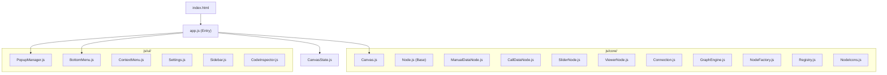

# Análisis de Código: Nodes Canvas Studio

Análisis completo del proyecto con oportunidades de **modularización** y **optimización**.

---

## 📊 Resumen del Proyecto

| Métrica | Valor |
|---|---|
| Archivos JS | 19 (12 core + 6 UI + 1 entry) |
| Archivos CSS | 8 |
| Total líneas JS | ~3,400 |
| Archivo más grande | [PopupManager.js](file:///d:/proyectos%20progamacion/Nodes%20canvas/js/ui/PopupManager.js) (561 líneas) |



---

## 🔴 Problemas Críticos

### 1. Código de Drag duplicado en 5 clases (Prioridad Alta)

Cada tipo de nodo ([Node.js](file:///d:/proyectos%20progamacion/Nodes%20canvas/js/core/Node.js), [ManualDataNode.js](file:///d:/proyectos%20progamacion/Nodes%20canvas/js/core/ManualDataNode.js), [CallDataNode.js](file:///d:/proyectos%20progamacion/Nodes%20canvas/js/core/CallDataNode.js), [SliderNode.js](file:///d:/proyectos%20progamacion/Nodes%20canvas/js/core/SliderNode.js), [ViewerNode.js](file:///d:/proyectos%20progamacion/Nodes%20canvas/js/core/ViewerNode.js)) implementa su **propia versión** de la lógica de arrastre, selección y movimiento. Esto genera ~150 líneas duplicadas.

**Patrón repetido en cada clase:**

```javascript
// Este bloque aparece casi idéntico en 5 archivos:
e.stopPropagation();
const canvasTransform = window.NodesCanvas.canvas.transform;
if (!e.ctrlKey && !this.element.classList.contains('selected')) {
    document.querySelectorAll('.node.selected').forEach(n => n.classList.remove('selected'));
}
this.element.classList.add('selected');
// ... cálculos de drag offset ...
// ... mousemove handler ...
// ... mouseup handler ...
```

**Archivos afectados:**
- [Node.js](file:///d:/proyectos%20progamacion/Nodes%20canvas/js/core/Node.js) → [initHeaderEvents()](file:///d:/proyectos%20progamacion/Nodes%20canvas/js/core/Node.js#104-170) + [initEvents()](file:///d:/proyectos%20progamacion/Nodes%20canvas/js/core/Canvas.js#23-135)
- [ManualDataNode.js](file:///d:/proyectos%20progamacion/Nodes%20canvas/js/core/ManualDataNode.js) → [initEvents()](file:///d:/proyectos%20progamacion/Nodes%20canvas/js/core/Canvas.js#23-135)
- [CallDataNode.js](file:///d:/proyectos%20progamacion/Nodes%20canvas/js/core/CallDataNode.js) → [initEvents()](file:///d:/proyectos%20progamacion/Nodes%20canvas/js/core/Canvas.js#23-135)
- [SliderNode.js](file:///d:/proyectos%20progamacion/Nodes%20canvas/js/core/SliderNode.js) → [initEvents()](file:///d:/proyectos%20progamacion/Nodes%20canvas/js/core/Canvas.js#23-135)
- [ViewerNode.js](file:///d:/proyectos%20progamacion/Nodes%20canvas/js/core/ViewerNode.js) → [initEvents()](file:///d:/proyectos%20progamacion/Nodes%20canvas/js/core/Canvas.js#23-135)

> [!CAUTION]
> [Node.js](file:///d:/proyectos%20progamacion/Nodes%20canvas/js/core/Node.js) agrega listeners a `window` en [initEvents()](file:///d:/proyectos%20progamacion/Nodes%20canvas/js/core/Canvas.js#23-135) sin removerlos al destruir el nodo. **Cada nodo creado agrega 2 listeners globales que nunca se eliminan** → memory leak progresivo.

---

### 2. [escapeHtml()](file:///d:/proyectos%20progamacion/Nodes%20canvas/js/core/ViewerNode.js#141-144) repetida en 4 archivos

La misma función utilitaria aparece en:
- [ManualDataNode.js](file:///d:/proyectos%20progamacion/Nodes%20canvas/js/core/ManualDataNode.js)
- [CallDataNode.js](file:///d:/proyectos%20progamacion/Nodes%20canvas/js/core/CallDataNode.js)
- [SliderNode.js](file:///d:/proyectos%20progamacion/Nodes%20canvas/js/core/SliderNode.js)
- [ViewerNode.js](file:///d:/proyectos%20progamacion/Nodes%20canvas/js/core/ViewerNode.js)

**Solución:** Crear un módulo `utils.js` con funciones compartidas.

---

### 3. Búsqueda de instancias inconsistente

El patrón para encontrar instancias de nodos se repite en muchos lugares con **variaciones inconsistentes**:

```javascript
// En algunos archivos (3 registros):
window.NodesCanvas._nodeInstances[id] ||
window.NodesCanvas._panelInstances?.[id] ||
window.NodesCanvas._callInstances?.[id];

// En ViewerNode.js (4 registros):
window.NodesCanvas._nodeInstances?.[id] ||
window.NodesCanvas._panelInstances?.[id] ||
window.NodesCanvas._callInstances?.[id] ||
window.NodesCanvas._viewerInstances?.[id];
```

Algunos archivos olvidan buscar en `_viewerInstances`, lo que causa **bugs silenciosos** donde los ViewerNodes no participan del multi-drag en ciertos contextos.

---

## 🟡 Oportunidades de Modularización

### 4. Crear `BaseNode.js` — Clase base compartida

Extraer la lógica común a una clase base que todas las variantes extiendan:

```javascript
// Propuesta: js/core/BaseNode.js
class BaseNode {
    constructor(config) { /* id, x, y, element, isDragging, dragOffsets */ }
    createElement()     { /* crear div.node con transform */ }
    updatePosition()    { /* aplicar transform CSS */ }
    initDragEvents()    { /* lógica de drag/select compartida */ }
    getInstance(id)     { /* búsqueda unificada en todos los registros */ }
    escapeHtml(str)     { /* utilidad compartida */ }
    destroy()           { /* remover listeners + DOM */ }
}
```

Impacto: **Elimina ~250 líneas duplicadas** y arregla los bugs de consistencia.

---

### 5. Descomponer [PopupManager.js](file:///d:/proyectos%20progamacion/Nodes%20canvas/js/ui/PopupManager.js) (561 → ~3 archivos)

| Componente actual | Líneas | Archivo propuesto |
|---|---|---|
| [showSearch()](file:///d:/proyectos%20progamacion/Nodes%20canvas/js/ui/PopupManager.js#29-117) | ~90 | `SearchModal.js` |
| [showNodeForm()](file:///d:/proyectos%20progamacion/Nodes%20canvas/js/ui/PopupManager.js#118-442) | ~325 | `NodeFormModal.js` |
| [showSliderForm()](file:///d:/proyectos%20progamacion/Nodes%20canvas/js/ui/PopupManager.js#443-560) | ~120 | `SliderFormModal.js` |

---

### 6. Centralizar la inicialización

Actualmente hay 4 archivos con su propio `DOMContentLoaded`:
- [Connection.js](file:///d:/proyectos%20progamacion/Nodes%20canvas/js/core/Connection.js) → `ConnectionManager.init()`
- [ContextMenu.js](file:///d:/proyectos%20progamacion/Nodes%20canvas/js/ui/ContextMenu.js) → `new ContextMenu()`
- [Sidebar.js](file:///d:/proyectos%20progamacion/Nodes%20canvas/js/ui/Sidebar.js) → `new Sidebar()`
- [Settings.js](file:///d:/proyectos%20progamacion/Nodes%20canvas/js/ui/Settings.js) → `new Settings()`
- [CodeInspector.js](file:///d:/proyectos%20progamacion/Nodes%20canvas/js/ui/CodeInspector.js) → `CodeInspector.init()`

Mientras que [app.js](file:///d:/proyectos%20progamacion/Nodes%20canvas/js/app.js) inicializa otros componentes. Esto crea **dependencias de orden implícitas** (el orden de los `<script>` en HTML importa).

**Solución:** Mover toda la inicialización a [app.js](file:///d:/proyectos%20progamacion/Nodes%20canvas/js/app.js) con un orden explícito.

---

### 7. Crear `NodeInstanceRegistry.js`

Unificar los 4 mapas de instancias dispersos en un solo registro:

```javascript
// En vez de:
window.NodesCanvas._nodeInstances = {};
window.NodesCanvas._panelInstances = {};
window.NodesCanvas._callInstances = {};
window.NodesCanvas._viewerInstances = {};

// Propuesta:
window.NodesCanvas.NodeRegistry = {
    _instances: {},
    register(id, instance)  { ... },
    unregister(id)          { ... },
    get(id)                 { ... },
    getAll()                { ... },
    getByType(className)    { ... }
};
```

---

## 🟢 Optimizaciones de Rendimiento

### 8. Eventos: de global a delegado

**Problema:** [Node.js](file:///d:/proyectos%20progamacion/Nodes%20canvas/js/core/Node.js) agrega 2 `window` listeners por cada nodo (mousemove + mouseup). Con 50 nodos = **100 listeners globales** activos.

**Solución:** Usar un solo par de listeners delegados en [app.js](file:///d:/proyectos%20progamacion/Nodes%20canvas/js/app.js) o [Canvas.js](file:///d:/proyectos%20progamacion/Nodes%20canvas/js/core/Canvas.js):

```javascript
// Un solo listener para TODOS los nodos
window.addEventListener('mousemove', (e) => {
    const dragging = NodeRegistry.getDragging();
    dragging.forEach(inst => { /* mover */ });
});
```

---

### 9. `CanvasState.scheduleSave()` excesivo

Actualmente [app.js](file:///d:/proyectos%20progamacion/Nodes%20canvas/js/app.js) registra un `mouseup` global + un `wheel` sobre el canvas que disparan [scheduleSave()](file:///d:/proyectos%20progamacion/Nodes%20canvas/js/core/CanvasState.js#10-15) constantemente. El debounce interno ayuda, pero se podrían consolidar los triggers.

---

### 10. `Connection.updatePath()` — Recalcular solo lo necesario

[updateAllConnections()](file:///d:/proyectos%20progamacion/Nodes%20canvas/js/core/Connection.js#225-228) itera **todas** las conexiones en cada frame de drag. Se podría optimizar actualizando solo las conexiones vinculadas al nodo en movimiento.

---

## 🏗️ Arquitectura Backend Sugerida (Xano)

Para permitir persistencia multi-usuario y funciones compartidas entre tableros, se propone la siguiente estructura en Xano.

### 🗄️ Esquema de Base de Datos

#### 1. Tabla `user`
- [id](file:///d:/proyectos%20progamacion/Nodes%20canvas/js/ui/ContextMenu.js#137-144): integer (Primary Key)
- `created_at`: timestamp
- [name](file:///d:/proyectos%20progamacion/Nodes%20canvas/js/core/Registry.js#177-186): text
- `email`: text (unique)
- `password`: password
- `settings`: json (preferencias de UI)

#### 2. Tabla `board`
- [id](file:///d:/proyectos%20progamacion/Nodes%20canvas/js/ui/ContextMenu.js#137-144): integer (Primary Key)
- `user_id`: integer (FK to `user.id`)
- [name](file:///d:/proyectos%20progamacion/Nodes%20canvas/js/core/Registry.js#177-186): text
- `description`: text
- `data`: json (contiene nodos, conexiones y transformaciones)
- `is_public`: boolean
- `created_at`: timestamp
- `updated_at`: timestamp

#### 3. Tabla `user_function`
- [id](file:///d:/proyectos%20progamacion/Nodes%20canvas/js/ui/ContextMenu.js#137-144): integer (Primary Key)
- `user_id`: integer (FK to `user.id`)
- [name](file:///d:/proyectos%20progamacion/Nodes%20canvas/js/core/Registry.js#177-186): text
- `description`: text
- `icon`: text
- `inputs`: json
- `outputs`: json
- `code`: text (XanoScript o JS)
- `category`: text (para el sidebar)
- `is_global`: boolean (si es una función pública del sistema)

### 🔌 API Endpoints (Grupos de API)

#### **Auth**
- `POST /auth/signup`: Registro de usuario
- `POST /auth/login`: Login y obtención de JWT
- `GET /auth/me`: Información del usuario actual

#### **Boards**
- `GET /boards`: Listar tableros del usuario
- `POST /boards`: Crear nuevo tablero
- `GET /boards/{id}`: Obtener detalle completo de un tablero
- `PATCH /boards/{id}`: Guardar cambios en `data` (Auto-save)
- `DELETE /boards/{id}`: Eliminar tablero

#### **Functions (Registry)**
- `GET /functions`: Obtener todas las funciones (propias + compartidas) para poblar el [Registry.js](file:///d:/proyectos%20progamacion/Nodes%20canvas/js/core/Registry.js)
- `POST /functions`: Guardar una nueva función creada en el editor
- `PATCH /functions/{id}`: Actualizar definición de función
- `DELETE /functions/{id}`: Eliminar función

---

## 🛠️ Proposed Changes

### [Phase 1: Foundation]
Modularización base para eliminar duplicación y memory leaks.

#### [NEW] [BaseNode.js](file:///d:/proyectos%20progamacion/Nodes%20canvas/js/core/BaseNode.js)
Clase abstracta que centraliza:
- Constructor común (id, x, y).
- Lógica de Arrastre (MouseDown, MouseMove, MouseUp delegados).
- Lógica de Selección (simple y multi-select).
- Métodos utilitarios ([escapeHtml](file:///d:/proyectos%20progamacion/Nodes%20canvas/js/core/ViewerNode.js#141-144), [updatePosition](file:///d:/proyectos%20progamacion/Nodes%20canvas/js/core/Node.js#100-103)).

#### [NEW] [NodeRegistry.js](file:///d:/proyectos%20progamacion/Nodes%20canvas/js/core/NodeRegistry.js)
Gestor central de instancias que reemplaza los 4 objetos globales dispersos.

#### [NEW] [utils.js](file:///d:/proyectos%20progamacion/Nodes%20canvas/js/utils/utils.js)
Utilidades compartidas (DOM helpers, string manipulation).

### [Phase 2: Refactoring Node Classes]
Actualización de clases existentes para heredar de `BaseNode`.

#### [MODIFY] [Node.js](file:///d:/proyectos%20progamacion/Nodes%20canvas/js/core/Node.js)
#### [MODIFY] [ManualDataNode.js](file:///d:/proyectos%20progamacion/Nodes%20canvas/js/core/ManualDataNode.js)
#### [MODIFY] [CallDataNode.js](file:///d:/proyectos%20progamacion/Nodes%20canvas/js/core/CallDataNode.js)
#### [MODIFY] [SliderNode.js](file:///d:/proyectos%20progamacion/Nodes%20canvas/js/core/SliderNode.js)
#### [MODIFY] [ViewerNode.js](file:///d:/proyectos%20progamacion/Nodes%20canvas/js/core/ViewerNode.js)

### [Phase 3: Central Initialization]
#### [MODIFY] [app.js](file:///d:/proyectos%20progamacion/Nodes%20canvas/js/app.js)
Limpieza de listeners redundantes y orquestación de la carga inicial.

---

¿Quieres que proceda con la implementación de estos cambios? Puedo empezar por los de mayor impacto y menor riesgo (items 1-5).
